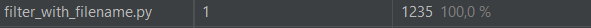

# Инструменты разработки

### Время выполнения старого фильтра

### Время выполнения нового фильтра

Время работы старого фильтра оказалось намного меньше, чем у нового фильтра. Основной причиной данного результата стала функция ввода данных, которое у нового фильтра занимает примерно 88% всего времени, а у старого вовсе отсутствует.

### Время выполнения нового фильтра с введенными данными

Время работы значительно улучшилось. Благодаря импортированному модулю NumPy, работа с большими массивами данных в новом фильтре стала быстрее, чем работа с теми же массивами, но усилиями стандартных инструментов работы с массивами в Python.

---
### Фото без фильтров

### Фото со старым фильтром

### Фото с новым фильтром
